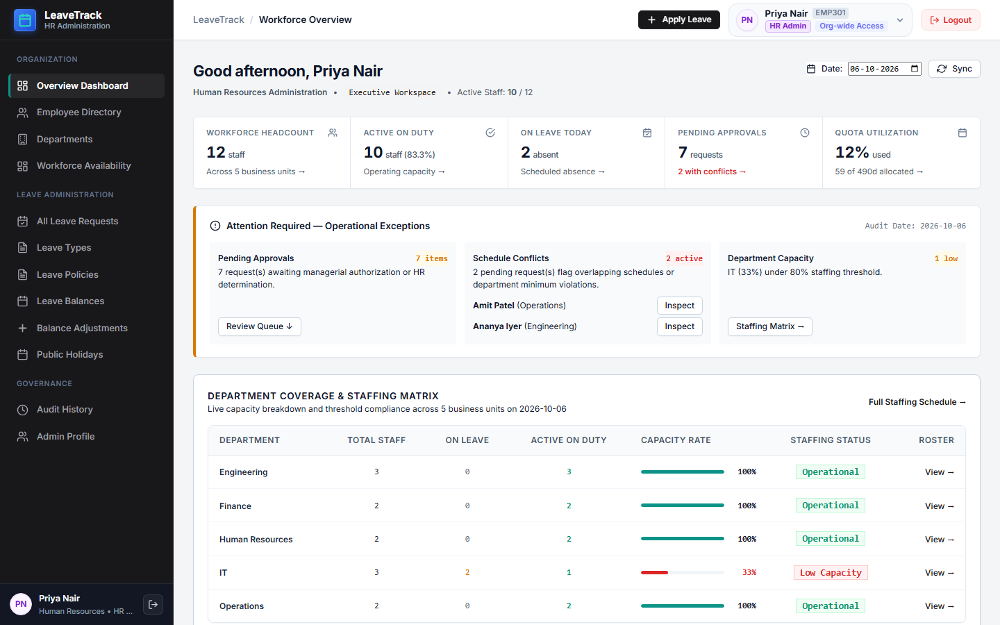
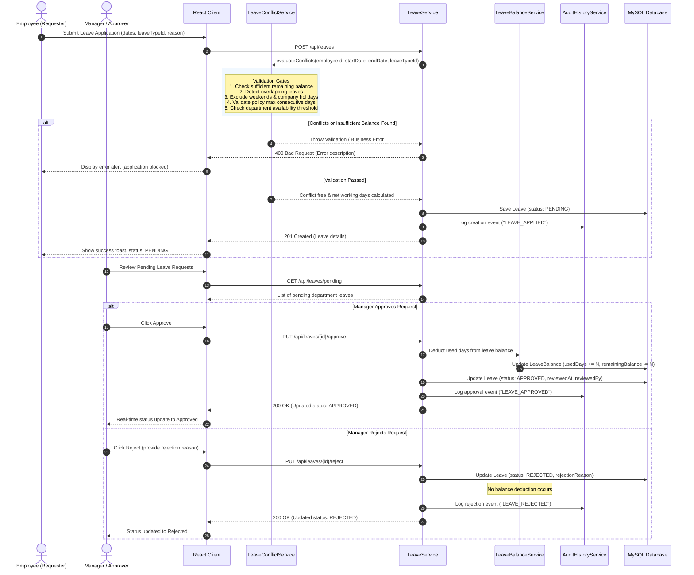
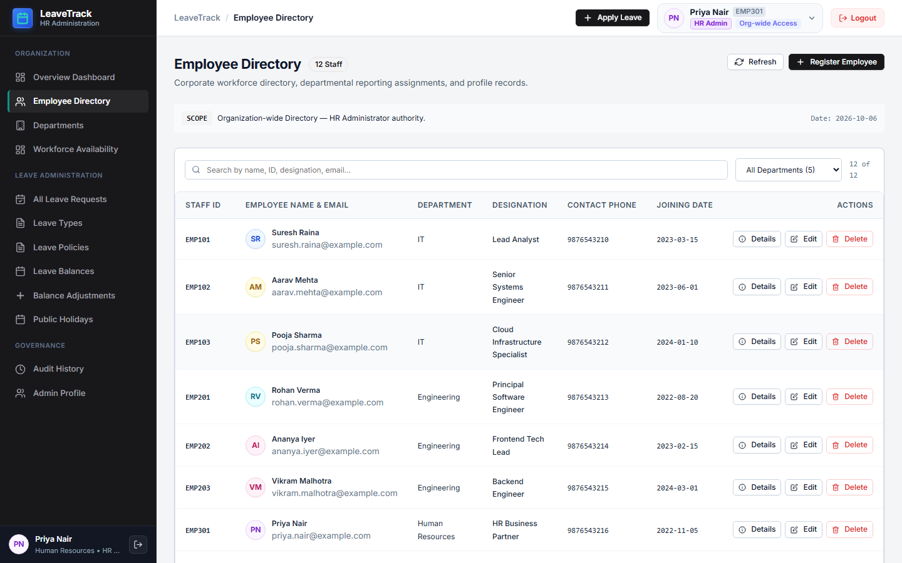
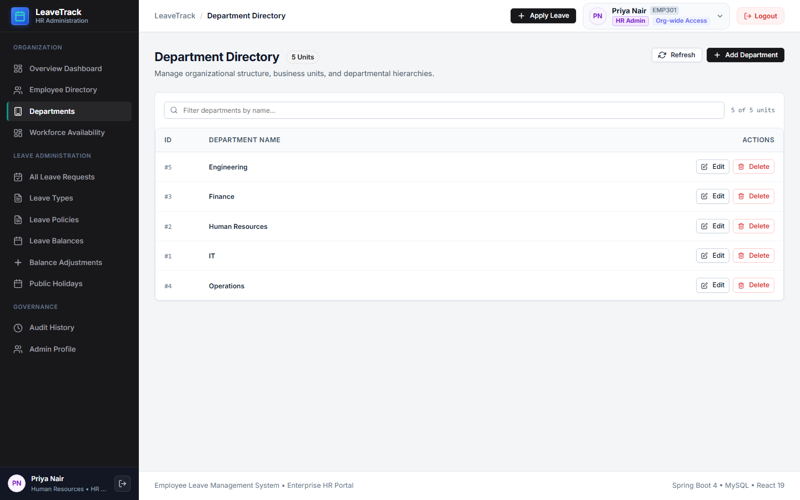
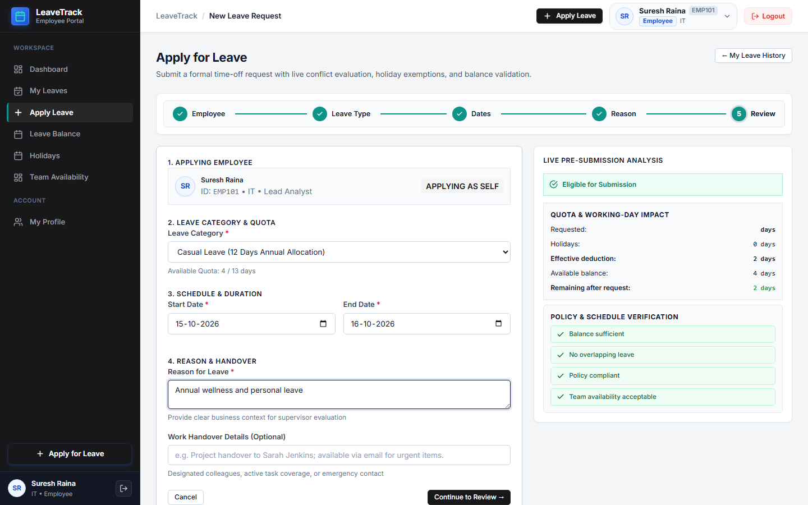
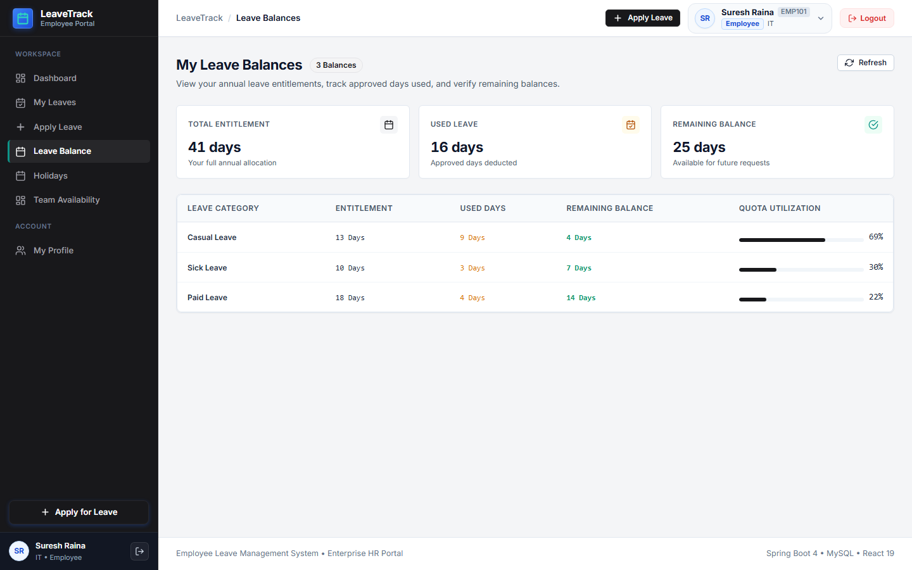
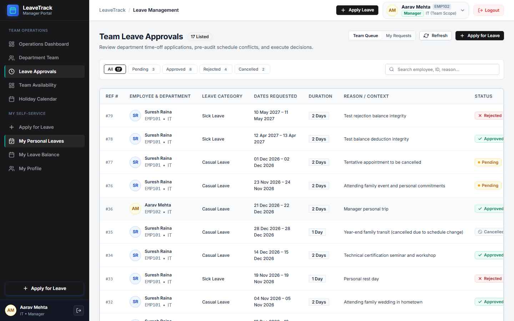
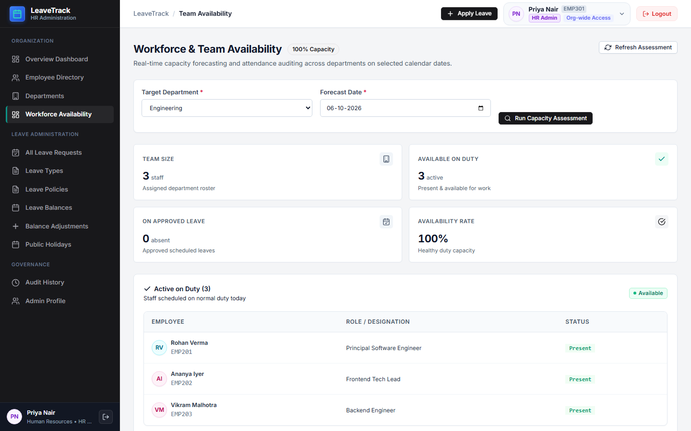
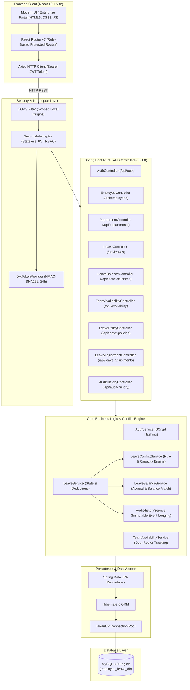
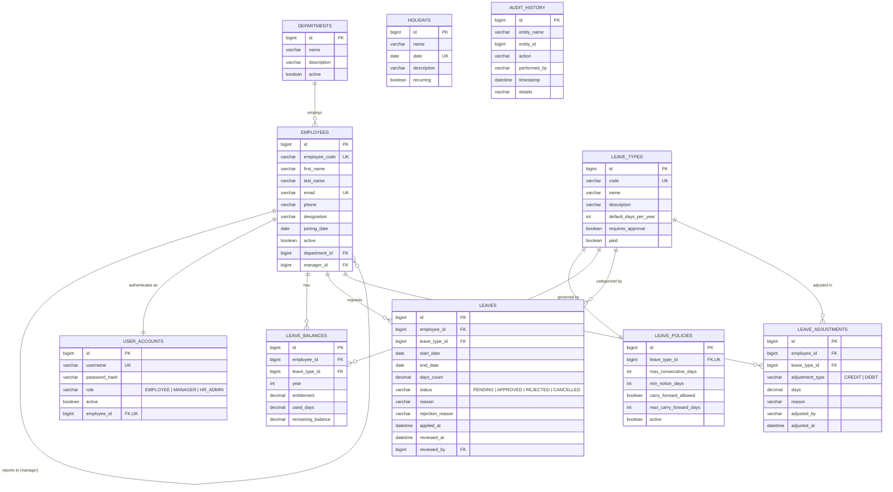

# Employee Leave Management System

<p align="center">
  
  
  
  
  
  
</p>

An enterprise-grade workforce leave management platform engineered with **Spring Boot 4**, **Java 21**, **React 19**, and **MySQL 8.0**. Built with authoritative server-side conflict detection, multi-tier role authorization, real-time department availability tracking, and automated balance deductions.

---

## Project Preview



> **Enterprise Manager Dashboard**: Real-time KPI summaries, dynamic leave utilization metrics, team availability calendars, and instant pending approval actions.

---

## Why This Project?

Traditional human resource operations frequently suffer from:
- **Disjointed spreadsheets & email threads** that lead to untracked absences and balance discrepancies.
- **Unchecked scheduling conflicts** where multiple key employees in the same department take concurrent leaves, degrading operational capacity.
- **Lack of authoritative policy enforcement**, allowing employees to submit invalid date ranges, exceed consecutive day caps, or overdraw remaining leave balances.
- **Absent audit trails**, leaving HR administrators without historical visibility into balance modifications or managerial approvals.

The **Employee Leave Management System** resolves these operational challenges by combining a deterministic server-side **Conflict Engine** with self-service employee portals, managerial approval workflows, and centralized HR governance.

---

## Key Features

### 👤 Employee Self-Service
- **Dynamic Balance Insights**: Live tracking of Annual, Sick, Casual, Maternity, and Unpaid leave entitlements, consumed days, and remaining balances.
- **Smart Leave Application**: Integrated pre-submission review that validates dates against company holidays and weekends.
- **Request Ledger**: Comprehensive leave request history with real-time status tracking (`Pending`, `Approved`, `Rejected`, `Cancelled`).
- **Team Availability Visibility**: Department calendar showing approved leaves to facilitate thoughtful request planning.

### 👥 Managerial Oversight
- **Two-Tier Approval Workflow**: Review, approve, or reject department requests with mandatory rejection reasoning.
- **Department Capacity Guard**: Real-time staffing thresholds that warn managers if department coverage falls below acceptable limits.
- **Instant Balance Impact**: Authoritative atomic deductions executed immediately upon request approval.

### 🏢 HR Administration & Governance
- **Workforce Directory**: Centralized management of employee profiles, organizational designations, and hierarchical manager assignments.
- **Department Architecture**: Department creation, management, and staffing distribution tracking.
- **Leave Types & Policies**: Granular configuration of annual entitlements, maximum consecutive day limits, advance notice requirements, and carry-forward rules.
- **Manual Balance Adjustments**: Administrative credit/debit adjustments backed by mandatory reason tracking.
- **Immutable Audit Trail**: Append-only system log capturing actions across users, leaves, policies, and balance modifications.

---

## Application Flow



---

## Application Screenshots

### 1. Dashboard Overview

*Role-aware metrics, quick links, pending approval alerts, and department attendance statistics.*

### 2. Employee Directory

*HR directory featuring employee codes, designations, department mapping, manager hierarchies, and active account status.*

### 3. Department Management

*Organizational unit configuration, operational headcount, and department status tracking.*

### 4. Leave Application & Conflict Engine

*Self-service leave booking with real-time balance previews, date calculation, and conflict policy checks.*

### 5. Leave Tracking & History

*Comprehensive employee request ledger with status chips, working days count, and self-service cancellation.*

### 6. Manager Approval Workflow

*Managerial review table for pending team leaves with direct Approve and Reject decision actions.*

### 7. Team Availability & Workforce Calendar

*Department attendance matrix detailing scheduled absences to prevent operational understaffing.*

---

## System Architecture



### Architectural Principles
- **Authoritative Backend Validation**: Validation logic (insufficient balance, overlap detection, consecutive days limit, and holiday deduction) is evaluated server-side in `LeaveConflictService`.
- **Role-Based Access Control (RBAC)**: Custom `SecurityInterceptor` validates signed HMAC-SHA256 JWT tokens and validates required role privileges (`EMPLOYEE`, `MANAGER`, `HR_ADMIN`) on every protected route.
- **Transactional Integrity**: All leave status updates, balance deductions, and audit logging execute within atomic `@Transactional` database transactions.

---

## Database Design



---

## Technology Stack

| Layer | Technology | Version | Purpose |
| :--- | :--- | :--- | :--- |
| **Backend Runtime** | Java JDK | `21` | Modern LTS Java runtime environment |
| **Backend Framework** | Spring Boot | `4.1.1` | Core REST API, IoC container, configuration |
| **Persistence** | Spring Data JPA / Hibernate | `6.x` | ORM, transactional data management, repository queries |
| **Security & Crypto** | Spring Security Crypto | `4.1.1` | BCrypt password hashing & salt verification |
| **Authentication** | Custom JWT Token Provider | `24h Exp` | Stateless HMAC-SHA256 authentication |
| **Database** | MySQL | `8.0+` | Relational persistence engine |
| **Frontend Framework** | React | `19.2.8` | Component-based reactive UI |
| **Frontend Routing** | React Router DOM | `7.18.4` | Role-based declarative client-side routing |
| **HTTP Client** | Axios | `1.20.0` | Promise-based HTTP client with Bearer interceptors |
| **Frontend Tooling** | Vite | `8.3.0` | Ultra-fast client build tool & development server |
| **Linting** | Oxlint | `1.81.0` | High-performance JavaScript/React linter |

---

## Project Structure

```text
employee-leave-management/
│
├── frontend/                              # React 19 Client Application
│   ├── src/
│   │   ├── components/                    # Reusable Design System Components
│   │   │   ├── Avatar.jsx                 # User profile avatar chip
│   │   │   ├── FormField.jsx              # Accessible form input wrapper
│   │   │   ├── Header.jsx                 # Top bar with user role & identity
│   │   │   ├── Icons.jsx                  # Feather SVG icon components
│   │   │   ├── ProtectedRoute.jsx         # RBAC route authorization guard
│   │   │   ├── SearchFilterBar.jsx        # Table search & status filter bar
│   │   │   ├── Sidebar.jsx                # Responsive role-aware navigation
│   │   │   ├── SkeletonLoader.jsx         # Card & table loading placeholders
│   │   │   ├── StatCard.jsx               # Enterprise KPI metrics card
│   │   │   └── StatusBadge.jsx            # Standardized leave status badge
│   │   ├── context/
│   │   │   └── AuthContext.jsx            # Authentication state & session manager
│   │   ├── pages/                         # Core Application Views
│   │   │   ├── ApplyLeave.jsx             # Leave application & conflict inspector
│   │   │   ├── AuditHistory.jsx           # Immutable audit log viewer
│   │   │   ├── Departments.jsx            # Department management view
│   │   │   ├── EmployeeDashboard.jsx      # Employee self-service dashboard
│   │   │   ├── Employees.jsx              # Employee directory & profiles
│   │   │   ├── Holidays.jsx               # Holiday calendar view
│   │   │   ├── HRAdminDashboard.jsx       # HR administrative dashboard
│   │   │   ├── LeaveAdjustments.jsx       # Manual credit/debit adjustments
│   │   │   ├── LeaveBalances.jsx          # Leave balance ledger
│   │   │   ├── LeavePolicies.jsx          # Policy & entitlement rules view
│   │   │   ├── LeaveTypes.jsx             # Leave category configuration
│   │   │   ├── Leaves.jsx                 # Leave requests tracking & approvals
│   │   │   ├── Login.jsx                  # Enterprise login portal
│   │   │   ├── ManagerDashboard.jsx       # Manager oversight dashboard
│   │   │   ├── Profile.jsx                # User account profile
│   │   │   └── TeamAvailability.jsx       # Department availability calendar
│   │   ├── services/
│   │   │   └── api.js                     # Centralized Axios API client
│   │   ├── App.jsx                        # Root router configuration
│   │   ├── index.css                      # Global enterprise CSS design tokens
│   │   └── main.jsx                       # React DOM entry point
│   ├── package.json                       # Frontend dependencies & scripts
│   └── vite.config.js                     # Vite build configuration
│
├── src/                                   # Spring Boot 4 Backend Application
│   ├── main/
│   │   ├── java/com/example/employeeleave/
│   │   │   ├── config/                    # Security & Web MVC configurations
│   │   │   ├── controller/                # REST Controllers
│   │   │   ├── dto/                       # Data Transfer Objects & Requests
│   │   │   ├── entity/                    # JPA Domain Entities
│   │   │   ├── repository/                # Spring Data JPA Repositories
│   │   │   ├── security/                  # JWT Provider & Security Interceptor
│   │   │   └── service/                   # Core business logic & Conflict engine
│   │   └── resources/
│   │       ├── application.properties     # Production-safe configuration
│   │       └── application-example.properties # Template for local credentials
│   └── test/                              # Automated Unit & Integration Tests
│       └── java/com/example/employeeleave/
│           ├── security/                  # RBAC Authorization integration tests
│           └── service/                   # Service & Conflict engine tests
│
├── docs/                                  # Project Documentation & Assets
│   ├── diagrams/                          # Mermaid Architecture & Flow Source Files
│   ├── screenshots/                       # High-Resolution UI Screenshots
│   └── SCREENSHOT-PLAN.md                 # UI verification & screenshot strategy
│
├── pom.xml                                # Maven POM configuration
├── start-dev.ps1                          # Turnkey local development launcher
└── README.md                              # Main documentation file
```

---

## API Overview

All API endpoints are hosted under `/api/**`. Unauthenticated requests receive HTTP `401 Unauthorized`; requests lacking sufficient role privileges receive HTTP `403 Forbidden`.

| Method | Endpoint | Allowed Roles | Description |
| :--- | :--- | :--- | :--- |
| `POST` | `/api/auth/login` | Public | Authenticates user; returns signed JWT token and user info |
| `GET` | `/api/auth/me` | Authenticated | Retrieves profile of currently authenticated user |
| `POST` | `/api/auth/logout` | Authenticated | Terminates active user session |
| `GET` | `/api/leaves` | Authenticated | Retrieves leave requests (scoped to employee or department) |
| `POST` | `/api/leaves` | `EMPLOYEE`, `MANAGER`, `HR_ADMIN` | Submits new leave with Conflict Engine evaluation |
| `PUT` | `/api/leaves/{id}/approve` | `MANAGER`, `HR_ADMIN` | Approves request & executes atomic balance deduction |
| `PUT` | `/api/leaves/{id}/reject` | `MANAGER`, `HR_ADMIN` | Rejects request with required rejection reasoning |
| `PUT` | `/api/leaves/{id}/cancel` | `EMPLOYEE`, `MANAGER`, `HR_ADMIN` | Cancels pending leave request |
| `GET` | `/api/leaves/pending` | `MANAGER`, `HR_ADMIN` | Retrieves pending requests for manager's department |
| `GET` | `/api/leave-balances` | Authenticated | Retrieves leave balances (scoped by role) |
| `GET` | `/api/leave-balances/employee/{id}` | `MANAGER`, `HR_ADMIN` | Retrieves specific employee leave balances |
| `POST` | `/api/leave-adjustments` | `HR_ADMIN` | Performs manual credit/debit balance adjustment |
| `GET` | `/api/availability` | Authenticated | Retrieves department workforce availability for date range |
| `GET` | `/api/employees` | `MANAGER`, `HR_ADMIN` | Retrieves workforce employee directory |
| `POST` | `/api/employees` | `HR_ADMIN` | Creates new employee profile |
| `GET` | `/api/departments` | `HR_ADMIN` | Retrieves list of all organizational departments |
| `POST` | `/api/departments` | `HR_ADMIN` | Creates new organizational department |
| `GET` | `/api/leave-types` | Authenticated | Retrieves available leave categories and day quotas |
| `GET` | `/api/leave-policies` | `HR_ADMIN` | Retrieves policy rules (consecutive limits, carry-forward) |
| `GET` | `/api/holidays` | Authenticated | Retrieves official company holiday calendar |
| `GET` | `/api/audit-history` | `HR_ADMIN` | Retrieves system audit logs |
| `GET` | `/api/dashboard/stats` | Authenticated | Computes role-specific dashboard metrics |

---

## Testing & Verification

The system includes a comprehensive suite of unit tests, integration tests, and authorization security tests:

```text
========================================================================
TEST EXECUTION SUMMARY
========================================================================
Backend Tests Run:     147
Failures:              0
Errors:                0
Skipped:               0
Build Status:          BUILD SUCCESS (Total time: 19.855 s)

Frontend Linter:       oxlint v1.81.0 (37 files analyzed, 0 errors)
Frontend Production:   vite v8.3.1 build (built client in 361 ms)
========================================================================
```

### Verified Test Categories
- **RBAC Security Tests** (`AuthorizationTest`): Confirms HTTP `401` on unauthenticated calls, HTTP `403` when employees attempt administrative endpoints, and strict validation preventing managers from approving their own leaves.
- **Conflict Engine Tests** (`LeaveConflictServiceTest`): Confirms rejection of overlapping leaves, enforcement of consecutive-day policy limits, weekend and holiday day exclusions, and insufficient balance prevention.
- **Balance Arithmetic & Deductions** (`LeaveBalanceServiceTest`): Verifies single deduction upon approval (+used, -remaining) and zero deductions on rejection.
- **Workflow End-to-End Tests**: Live simulated workflows verifying Employee submission, Manager approval/rejection, and HR administrative configuration.

---

## Setup & Running Locally

### Prerequisites
- **JDK 21** installed (`java -version`)
- **MySQL 8.0+** running on port 3306
- **Node.js (v18+) & npm** (`node -v`, `npm -v`)
- **Git**

### Step 1 — Clone the Repository
```bash
git clone https://github.com/abhishekn27077/Employee-Leave_Management.git
cd Employee-Leave_Management
```

### Step 2 — Configure Database Credentials
The application is pre-configured to automatically create `employee_leave_db` in MySQL if it does not already exist.

If your local MySQL `root` user requires a password, choose either option:
- **Option A (Recommended — Git-safe file)**: Copy `src/main/resources/application-example.properties` to `src/main/resources/application-local.properties` (which is gitignored):
  ```properties
  spring.datasource.password=your_mysql_password
  ```
- **Option B (Environment Variable)**:
  ```powershell
  $env:DB_PASSWORD="your_mysql_password"
  ```

### Step 3 — Run the Application

#### Option 1: Turnkey One-Command Launcher (Windows PowerShell)
Run the automated startup script from the root directory:
```powershell
.\start-dev.ps1
```
*This verifies prerequisites, checks MySQL connectivity, and boots both Spring Boot and Vite in dedicated windows.*

#### Option 2: Manual Terminal Startup
**Terminal 1 — Start Backend:**
```powershell
.\mvnw.cmd spring-boot:run
```
*(Backend initializes on `http://localhost:8080`)*

**Terminal 2 — Start Frontend:**
```powershell
cd frontend
npm install
npm run dev
```
*(Frontend initializes on `http://localhost:5173`)*

---

## Demo Credentials

The application includes pre-seeded demo accounts for each role:

| Role | Username | Password | User Details |
| :--- | :--- | :--- | :--- |
| **Employee** | `employee` | `Employee@123` | Suresh Raina (Software Engineer, IT Department) |
| **Manager** | `manager` | `Manager@123` | Aarav Mehta (Engineering Manager, IT Department) |
| **HR Admin** | `admin` | `Admin@123` | Priya Nair (HR Director, Human Resources) |

> **Full Demo Workforce Directory**: For the complete directory of demo login credentials for all 12 seeded employees across IT, Engineering, Human Resources, Finance, and Operations departments, refer to [docs/DEMO_CREDENTIALS.md](docs/DEMO_CREDENTIALS.md).

---

## Environment Variables

| Variable | Default Value | Description |
| :--- | :--- | :--- |
| `DB_URL` | `jdbc:mysql://localhost:3306/employee_leave_db?createDatabaseIfNotExist=true` | JDBC Connection URL |
| `DB_USERNAME` | `root` | Database username |
| `DB_PASSWORD` | *(empty)* | Database password |
| `JWT_SECRET` | *(Auto-generated 256-bit)* | HMAC-SHA256 signature key (generates secure ephemeral key if unset) |
| `VITE_API_URL` | `http://localhost:8080/api` | Frontend API base URL |

---

## Roadmap

- [x] Spring Boot 4 REST API & JPA relational architecture
- [x] JWT Stateless Authentication & Role-Based Access Control
- [x] Authoritative server-side Leave Conflict & Capacity Engine
- [x] Employee self-service portal & live balance tracker
- [x] Manager approval workflow & team availability calendar
- [x] HR administrative configuration (Departments, Employees, Leave Policies)
- [x] Manual balance adjustments & immutable audit history
- [x] Modern enterprise design system (React 19 + Vite)
- [x] Full unit & integration test coverage (147 tests)
- [ ] Automated email & Slack notifications for approval requests
- [ ] Exportable payroll & absence reports (CSV / Excel / PDF)
- [ ] External calendar synchronization (Google Calendar / Microsoft Outlook)
- [ ] Multi-tenant enterprise SSO (SAML 2.0 / Okta / Azure AD)

---

## License

This project is maintained for educational and workforce management demonstration purposes. All rights reserved by the author.

---

## Author

Developed by **Abhishek** ([@abhishekn27077](https://github.com/abhishekn27077)).
